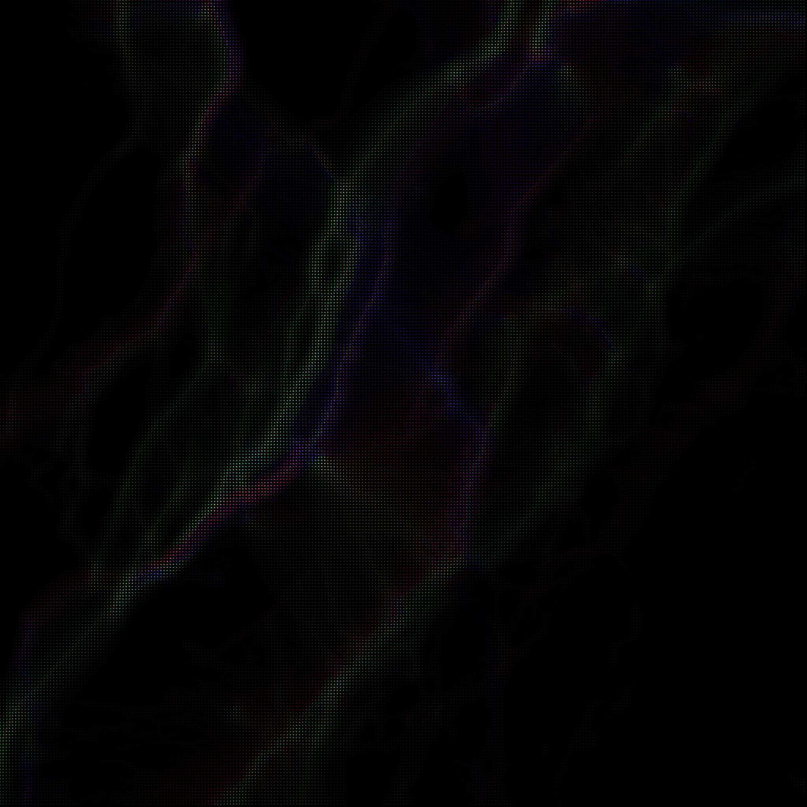
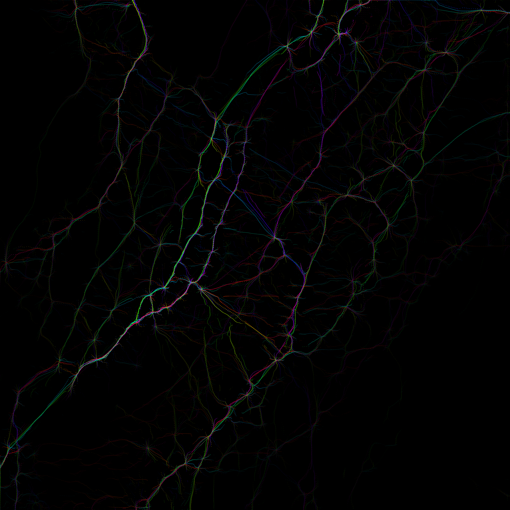
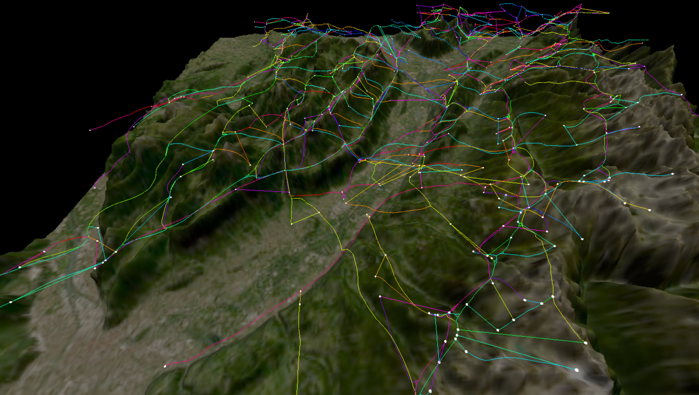

# Skyways

Work in progress!

## Data

`/data/data_11.f32` must be dowloaded from [here](https://drive.google.com/file/d/1DHrZWw_FXUYsjCyzOfxLtAPk97D03CD0/view?usp=drive_lin).

This file contains a 4-dimensional tensor with shape `(y, x, heading, altitude)`.

## Particles

### Initial State

    

### After Optimization

    <table>
    <tr>
        <td align="center" valign="bottom">
         Debug Image
        </td>
        <td align="center" valign="bottom">
         Viewer
        </td>
    </tr>
    </table>

## Linked Skyways

